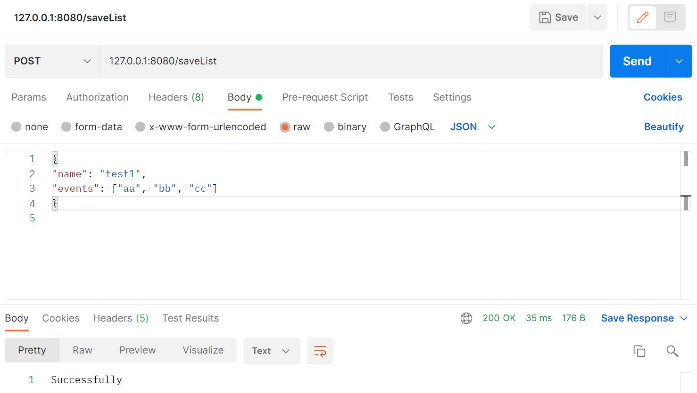
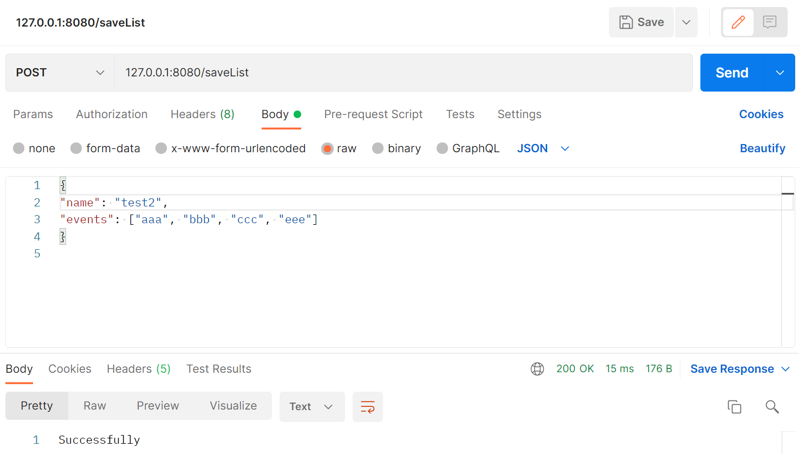
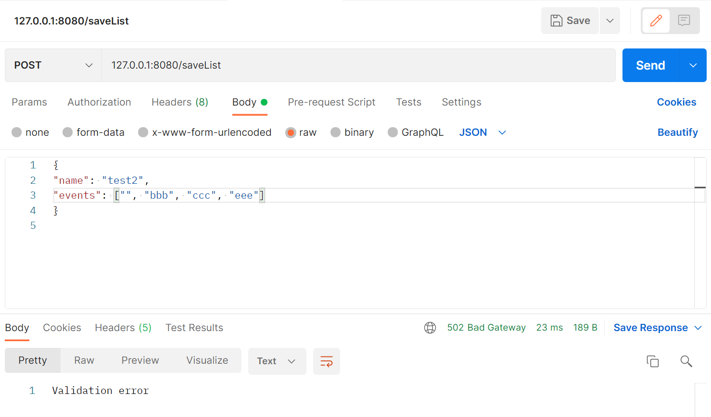
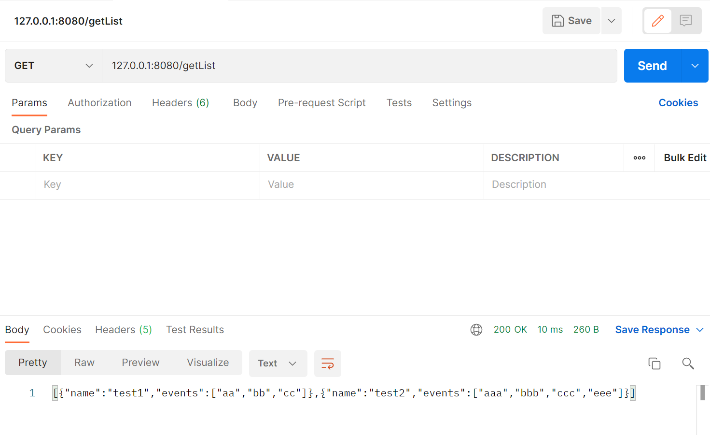

# java_skbCourse_hw78
## Демонстрация работы
`127.0.0.1:8080/saveList`
Добавление

Валидация:

Вывод элементов
`127.0.0.1:8080/getList`

## Запуск
1. Укажите данные от базы данных postgres в `application.properties`
2. Выполните следующие команды:
`mvn package`
`mvn spring-boot:run`